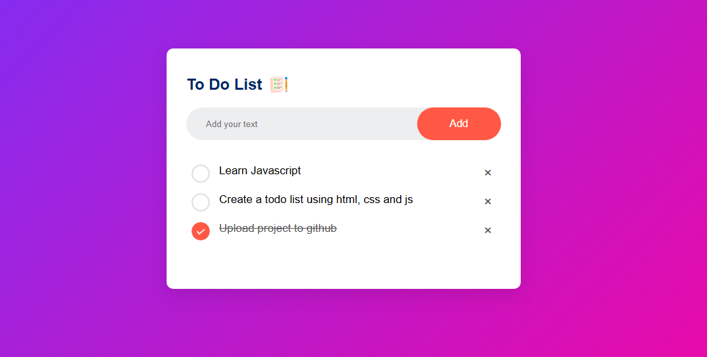

## 📝 To-Do List App
A simple and stylish To-Do List web application that lets you add, complete, and delete tasks — with your progress saved automatically using localStorage.

<!-- Replace with your actual screenshot path or GitHub image URL -->
## 📸 Demo



## 🚀 Features
✅ Add new tasks by clicking Add or pressing Enter

✏️ Check tasks off as complete (strike-through)

❌ Delete tasks using the “×” button

💾 Tasks are saved in your browser’s localStorage

🎨 Clean user interface with a purple gradient background

## 🔧 Technologies Used
- HTML

- CSS (with gradients and custom icons)

- JavaScript (DOM manipulation + localStorage)

## 📁 Folder Structure
```
project-folder/
│
├── index.html             # Main HTML file
├── style.css              # CSS styling
├── script.js              # JavaScript logic
├── images/
│   ├── unchecked.png      # Icon for incomplete task
│   ├── checked.png        # Icon for completed task
│   └── todo_screenshot.png # Optional screenshot for README
```
✅ How to Use
1. Clone the repo or download the ZIP

2. Open index.html in your browser

3. Start typing a task in the input box

4. Hit Enter or click Add

5. Click a task to mark it as done

6. Click the × to delete it

## 💡 Ideas for Improvement
- Add a due date for each task

- Enable task editing

- Add filters: All / Active / Completed

- Sync with a backend or Firebase
 ## Author
 Ellias Sithole
